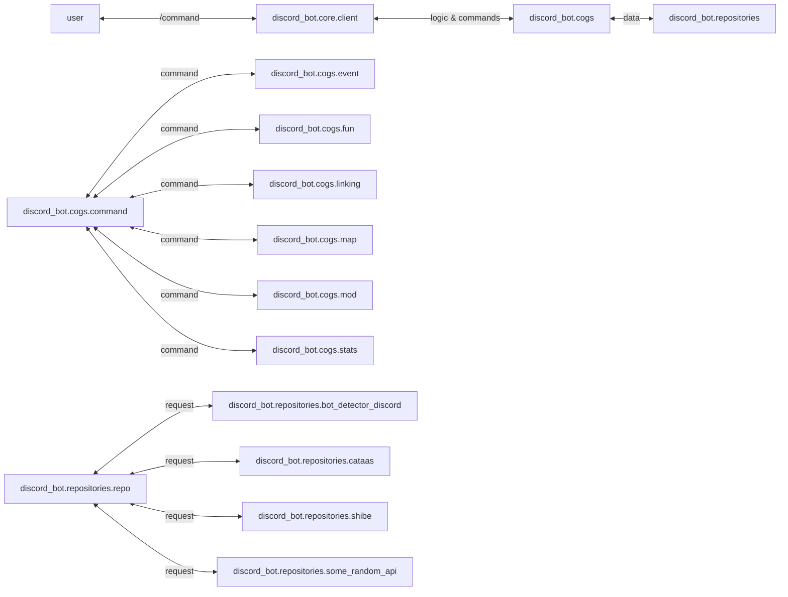

the desing of the discord bot is similar to the api in src.

we have three folders;
- `core`: contains the configuration & setup of the discord bot.
- `cogs`: contain the business logic & the individual commands of the discord bot.
- `repositories`: contain the different api's the system is calling for data.

