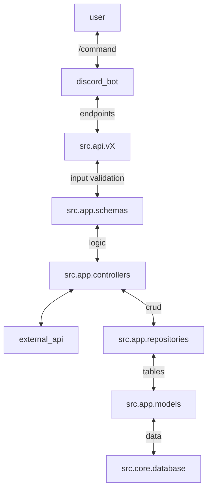

the src folder contains all the code for the api and is structured accoring to the MVC pattern.

- `api`: This directory contains the API layer of the application. It contains the API router, it is where you add the API endpoints.

- `app`: This directory contains the actual application code. It contains the models, repositories, controllers, and schemas for the application. This is the directory you will be spending most of your time in while building features. The directory has following sub-directories:

   - `models`: Here is where you add new tables
   - `repositories` For each model, you need to create a repository. This is where you add the CRUD operations for the model.
   - `controllers` For each logical unit of the application, you need to create a controller. This is where you add the business logic for the application.
   - `schemas` This is where you add the schemas for the application. The schemas are used for validation and serialization/deserialization of the data.

- `core`: here is where you find the configuration & setup of the api.
- `tests`: here is where you will find the tests.

